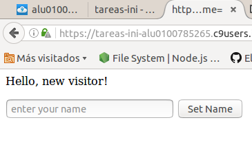
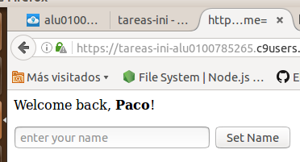
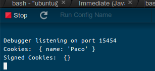

## Ejemplo 

> El ejemplo siguiente utiliza este módulo junto con el servidor HTTP principal 
de Node.js para solicitar a un usuario su nombre y mostrarlo de nuevo en futuras visitas.

> ```javascript
var cookie = require('cookie');
var escapeHtml = require('escape-html');
var http = require('http');
var url = require('url');
 
> function onRequest(req, res) {
  // Parse the query string 
  var query = url.parse(req.url, true, true).query;
 
>  if (query && query.name) {
    // Set a new cookie with the name 
    res.setHeader('Set-Cookie', cookie.serialize('name', String(query.name), {
      httpOnly: true,
      maxAge: 60 * 60 * 24 * 7 // 1 week 
    }));
    
 
>    // Redirect back after setting cookie 
    res.statusCode = 302;
    res.setHeader('Location', req.headers.referer || '/');
    res.end();
    return;
  }
 
>  // Parse the cookies on the request 
>  var cookies = cookie.parse(req.headers.cookie || '');
 
>  // Get the visitor name set in the cookie 
  var name = cookies.name;
  
 
>  res.setHeader('Content-Type', 'text/html; charset=UTF-8');
 
>  if (name) {
    res.write('<p>Welcome back, <b>' + escapeHtml(name) + '</b>!</p>');
  } 
  else {
    res.write('<p>Hello, new visitor!</p>');
  }
 
>  res.write('<form method="GET">');
  res.write('<input placeholder="enter your name" name="name"> <input type="submit" value="Set Name">');
  res.end('</form');
}
 
> http.createServer(onRequest).listen(8080);
```
Cuando entramos la primera vez no aparecerá lo siguiente


> 


> Una vez introducido un nombre en el input,quedará almacenado y cada vez que se entra sino se borran las cookies
> aparecerá lo siguiente:

> 


> El siguiente ejemplo que podremos encontrar en la carpeta src como el anterior,
al ejecutarlo nos mostrará en la consola las cookies que se guardaron en el ejemplo anterior:

> ```javascript
var express = require('express')
var cookieParser = require('cookie-parser')

> var app = express()
app.use(cookieParser())

> app.get('/', function (req, res) {
  
>   console.log('Cookies: ', req.cookies)

>  console.log('Signed Cookies: ', req.signedCookies)
})

> app.listen(8080)
```

> Ejemplo que muestra lo que aparece en consola cuando ejecutas el servidor:

> 