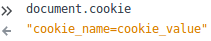
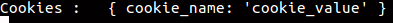
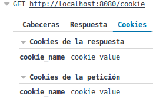
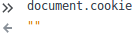

## Cookie Management

> ### Cookies en ExpressJS

> Lo primero que debemos hacer es instalar el middleware **cookie-parser** :

>```
>npm install cookie-parser

>```

> #### Funcionamiento

> Se debe hacer un require de cookie-parser en nuestra app:

>```javascript
> var express = require('express');
> var cookieParser = require('cookie-parser');

>var app = express();
app.use(cookieParser());

>```

> #### Sintáxis

> Cookie-parser analiza la cabecera de Cookies y rellena req.cookies con un objeto con los nombres de las cookies. Para establecer una nueva cookie, podemos definir una nueva ruta en nuestra aplicación express como:

> ```javascript
app.get('/cookie',function(req, res){
     res.cookie(cookie_name , 'cookie_value').send('Cookie is set');
});

>```

> Para comprobar si se ha establecido la cookie hay que dirigirse a la consola del navegador y escribir **document.cookie**.

> 

> El navegador envía nuevamente esa cookie al servidor cada vez que se hace una request de esa página. Y para obtener una cookie que un navegador podría estar enviando al servidor adjuntándolo a la cabecera de request, podemos escribir el siguiente código:

> ```javascript
app.get('/', function(req, res) {
  console.log("Cookies :  ", req.cookies);
});

>```

> 

> 

> #### Tiempo de expiración de cookie

> Se puede establecer un tiempo de expiración de cookie de la siguiente forma:

> ```javascript
res.cookie(name , 'value', {expire : new Date() + 9999});

>```

> Se pueden establecer opciones adicionales para las cookies pasando un objeto como argumento que contiene ajustes para las cookies. Asi que, para establecer el tiempo de expiración, un objeto con una propiedad **expire** puede ser enviado conteniendo el tiempo en milisegundos.

> Otra forma de establecer un tiempo de expiración es mediante el uso de la propiedad **maxAge**:

> ```javascript
res.cookie(name, 'value', {maxAge : 9999});

>```

> #### Eliminar cookies

> Para eliminar cookies ya existentes se utiliza el método **clearCookie**, pasándole el nombre de la cookie a eliminar:

> ```javascript
app.get('/clearcookie', function(req,res){
     res.clearCookie('cookie_name');
     res.send('Cookie deleted');
});

>```

> Como se observa en la siguiente imagen tras acceder a /clearcookie la cookie ha sido eliminada:

> 
