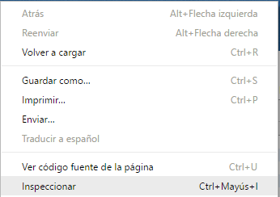
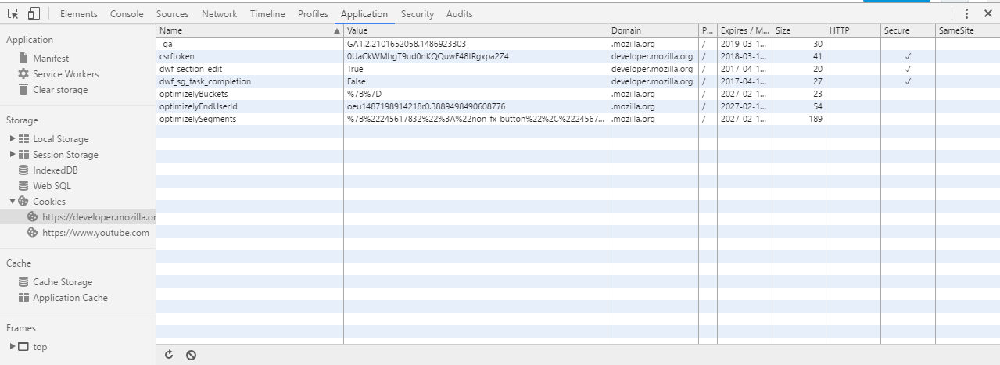

> ### Inspector de Almacenamiento

> El Inspector de almacenamiento le permite inspeccionar varios tipos de almacenamiento 
que una página web puede utilizar. Actualmente se puede utilizar para inspeccionar los 
siguientes tipos de almacenamiento:
* Caché de almacenamiento - la caché de cualquier DOM creados usando el API de caché .
* Galletas - Todas las galletas creadas por la página o cualquier iframes dentro de la página.
Las cookies creadas como parte de la respuesta de llamadas de red también se enumeran, 
pero sólo para las llamadas que sucedieron mientras la herramienta está abierta.
* Almacenamiento local - Todos los locales de almacenamiento elementos creados por la página o cualquier iframes dentro de la página.
* Almacenaje de la sesión - Todos almacenamiento sesión de elementos creados por la página o cualquier iframes dentro de la página.
* IndexedDB - Todos los IndexedDB bases de datos creadas por la página o cualquier iframes dentro de la página, 
sus almacenes de objetos y los artículos guardados en los almacenes de objetos.

> Para acceder a al una de las formas es boton derecho del raton y enel menu seleccionar inspeccionar.

> 

> Por el momento, el Inspector de almacenamiento sólo le da una vista de sólo lectura de almacenamiento.
Pero se esta trabajando para que pueda editar el contenido del almacenamiento en futuras versiones.

> 

