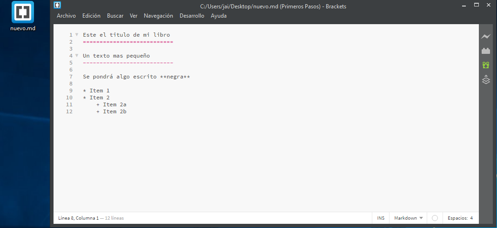
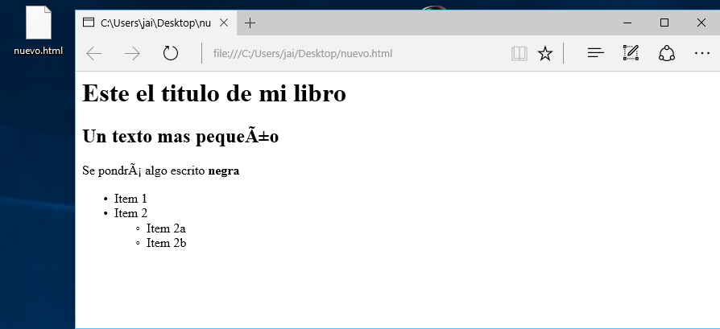
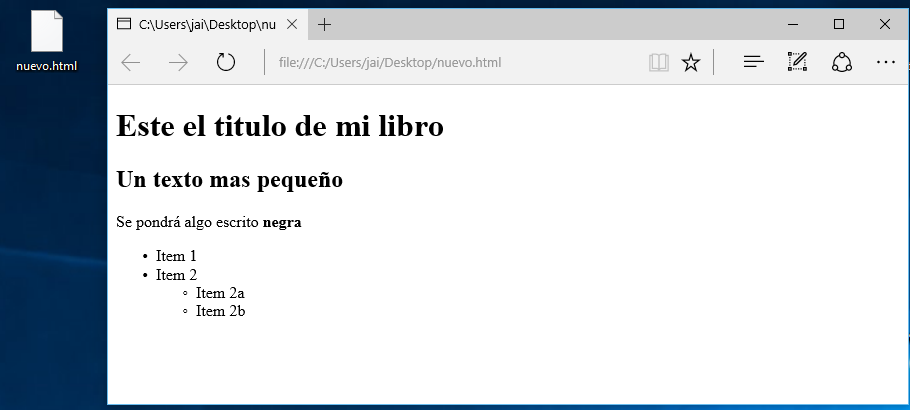
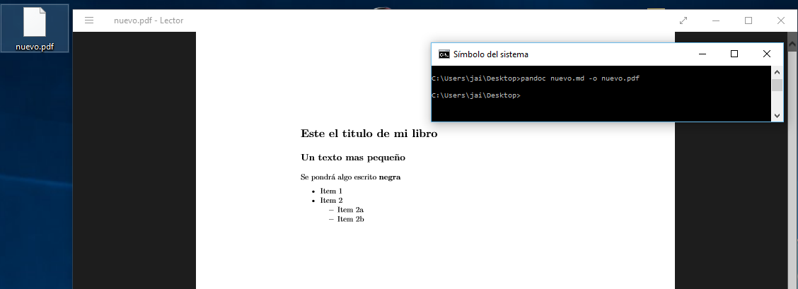

> ### Utilización
> Creamos un fichero md con código markdown 
> 
> Abrimos la consola de comando de windows, nos posicionamos donde esta el archivo
.md que hemos creado que en nuestro caso es **nuevo.md** y ejecutamos el 
siguiente comando  ```$ pandoc nuevo.md -o nuevo.html```.

> 

> Como vemos en la siguiente imagen se ha creado un archivo html que tendrá el siguiente aspecto.
> 

> Como vemos en la anterior imangen los caracter como la ñ no se visualizan 
para que estos carateres se puedan ver bien tenemos que coloacar la opcion -s en pandoc quedando asi el comando
```$ pandoc nuevo.md -s -o nuevo.html```, el html creado se relaizara de la siguiente manera.
> 

> ##### Otras Posibilidades de Conversiones

> ``` Nota: Para realizar las siguiente conversione hay que instalar : ``` [Latex](https://miktex.org/download "Latex").

> Para pasar de markdown a pdf, el comando es el siguiente ```$ pandoc nuevo.md -o nuevo.pdf``` dando como 
  resultado la siguiente imagen:

> 
  

> Para pasar de markdown a latex, el comando es el siguiente ```$  pandoc nuevo.md -f markdown -t latex -s -o nuevo.tex``` dando como 
  resultado la siguiente imagen:
  
> 


