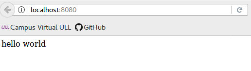

## Routing

> ### Introdcucción

> Hace referencia a la definición de puntos finales de aplicación (URI) y cómo responden a las solicitudes de cliente.

> El siguiente código es un ejemplo de un routing básico:

> ```javascript
var express = require('express')
var app = express()

> // respond with "hello world" when a GET request is made to the homepage
app.get('/', function (req, res) {
  res.send('hello world')
})
```
> Al ejecutarlo imprimirá 'hello world' en la ventana del navegador al realizar una petición GET a la página de inicio.

> 
