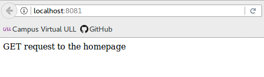
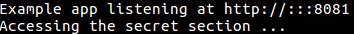

## Métodos de routing

>Un método de routing se deriva de uno de los [métodos HTTP](https://developer.mozilla.org/es/docs/Web/HTTP/Methods) y se adjunta a una instancia de la clase express.

>El siguiente código es un ejemplo de las rutas que se definen para los métodos GET y POST a la raíz de la aplicación:

>```javascript
// Ruta con método GET
app.get('/', function (req, res) {
  res.send('GET request to the homepage');
});

>// Ruta con método POST
app.post('/', function (req, res) {
  res.send('POST request to the homepage');
```

> Al ejecutarlo para GET:

> 

> Express da soporte a los siguientes métodos de direccionamiento que se corresponden con los métodos HTTP: get, post, put, head, delete, options, trace, copy, lock, mkcol, move, purge, propfind, proppatch, unlock, report, mkactivity, checkout, merge, m-search, notify, subscribe, unsubscribe, patch, search y connect.

> Hay un método de direccionamiento especial, **app.all()**, que no se deriva de ningún método HTTP. Este método se utiliza para cargar funciones de middleware en una vía de acceso para todos los métodos de solicitud.

> En el siguiente ejemplo, el manejador se ejecutará para las solicitudes a “/secret”, tanto si utiliza GET, POST, PUT, DELETE, como cualquier otro método de solicitud HTTP soportado en el módulo http:

>```javascript
app.all('/secret', function (req, res, next) {
  console.log('Accessing the secret section ...');
  next(); // pass control to the next handler
});
```

>Tras la ejecución se mostrará por consola el siguiente mensaje:

> 
