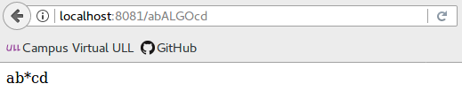
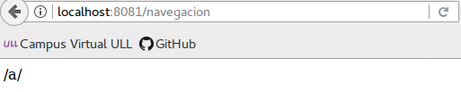
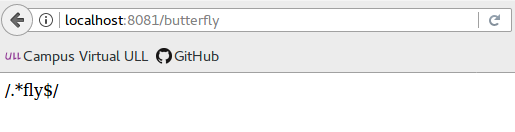

## Vías de acceso de ruta

> Las vías de acceso de ruta, en combinación con un método de solicitud, definen los puntos finales en los que pueden realizarse las solicitudes. Las vías de acceso de ruta pueden ser series, patrones de serie o expresiones regulares.

> ### Rutas basadas en series
> Estos son algunos ejemplos de vías de acceso de **ruta basadas en series**.
En este caso para las rutas que coincidan con la **raíz**:

> ```javascript
app.get('/', function (req, res) {
  res.send('root');
});
```
Al hacer una solicitud a **raíz** obtendremos el siguiente resultado:

>

> Ahora para las rutas que coincidan con **/about**:

>```javascript
app.get('/about', function (req, res) {
  res.send('about');
});
```
Al hacer la solicitud a /about obtendremos:

>

> Para las rutas que coincidan con **/random.text**:

>```javascript
app.get('/random.text', function (req, res) {
  res.send('random.text');
});
```
Al hacer la solicitud a /random.text obtendremos:

>

> ### Rutas basadas en patrones de serie
> A continuación se muestran algunos ejemplos de vías de acceso de ruta basadas en **patrones de serie**.

>Para las rutas que coincidan con **acd o abcd**:
>```javascript
app.get('/ab?cd', function(req, res) {
  res.send('ab?cd');
});
```

>Al hacer la solicitud a /acd o /abcd obtendremos:

>

>

>La siguiente vía de acceso de ruta coincidirá con cualquier cadena que empiece por **ab y acabe en cd**, sin importar los caracteres que se encuentren en medio:
>```javascript
app.get('/ab*cd', function(req, res) {
  res.send('ab*cd');
});
```

>

>Esta vía de acceso de ruta coincidirá con **/abe y /abcde**.

>```javascript
app.get('/ab(cd)?e', function(req, res) {
 res.send('ab(cd)?e');
});
```

>

>

> ### Rutas basadas en expresiones regulares

> Esta vía de acceso de ruta coincidirá con cualquier valor con una “a” en el nombre de la ruta.

>```javascript
app.get(/a/, function(req, res) {
  res.send('/a/');
});
```
>

>La siguiente vía de acceso de ruta coincidirá con butterfly y dragonfly, pero no con butterflyman, dragonfly man, etc.

>```javascript
app.get(/.*fly$/, function(req, res) {
  res.send('/.*fly$/');
});
```

>
