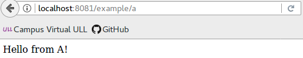
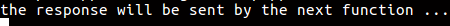
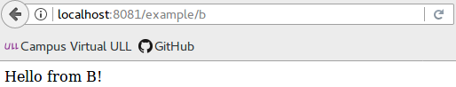
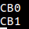
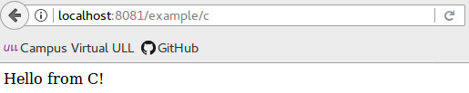
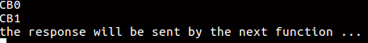
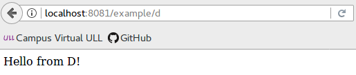
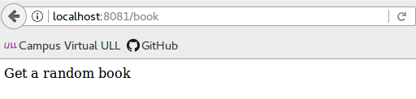
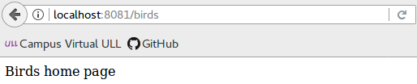
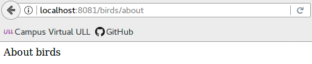

## Manejadores de rutas

> Puede proporcionar varias funciones de devolución de llamada que se comportan como middleware para manejar una solicitud. La única excepción es que estas devoluciones de llamada pueden invocar next('route') para omitir el resto de las devoluciones de llamada de ruta. Puede utilizar este mecanismo para imponer condiciones previas en una ruta y, a continuación, pasar el control a las rutas posteriores si no hay motivo para continuar con la ruta actual.

> **Una función** de devolución de llamada individual puede manejar una ruta. Por ejemplo:

>```javascript
app.get('/example/a', function (req, res) {
  res.send('Hello from A!');
});
```

>

>**Más de una función** de devolución de llamada puede manejar una ruta (asegúrese de especificar el objeto next). Por ejemplo:

>```javascript
app.get('/example/b', function (req, res, next) {
  console.log('the response will be sent by the next function ...');
  next();
}, function (req, res) {
  res.send('Hello from B!');
});
```

>Por la terminal se mostrará lo siguiente:
>

> En el navegador se mostrará lo siguiente:
>

>**Una matriz de funciones** de devolución de llamada puede manejar una ruta. Por ejemplo:

> ```javascript

> var cb0 = function (req, res, next) {
  console.log('CB0');
  next();
}

> var cb1 = function (req, res, next) {
  console.log('CB1');
  next();
}

> var cb2 = function (req, res) {
  res.send('Hello from C!');
}

> app.get('/example/c', [cb0, cb1, cb2]);


> ```

> Por la terminal se mostrará:

>

> En en navegador se mostrará:
>

>**Una combinación de funciones independientes y matrices de funciones** puede manejar una ruta. Por ejemplo:

> ```javascript

> var cb0 = function (req, res, next) {
  console.log('CB0');
  next();
}
> var cb1 = function (req, res, next) {
  console.log('CB1');
  next();
}

> app.get('/example/d', [cb0, cb1], function (req, res, next) {
  console.log('the response will be sent by the next function ...');
  next();
}, function (req, res) {
  res.send('Hello from D!');
});

> ```

>Por terminal se mostrará:
>

>Por el navegador se mostrará:
>

> ### Manejadores de rutas escalables

> Puede crear manejadores de rutas encadenables para una vía de acceso de ruta utilizando **app.route()**.

> ```javascript

> app.route('/book')
>   .get(function(req, res) {
    res.send('Get a random book');
  })

>   .post(function(req, res) {
    res.send('Add a book');
  })
  .put(function(req, res) {
      res.send('Update the book');
    });
> ```

> Realizando una petición GET se mostrará lo siguiente:

>

> ### Manejadores de rutas montables y modulares

> Utilice la clase **express.Router** para crear manejadores de rutas montables y modulares. Una instancia Router es un sistema de middleware y direccionamiento completo; por este motivo, a menudo se conoce como una “miniaplicación”.

> ```javascript

> var express = require('express');
> var router = express.Router();

>   // middleware that is specific to this router
router.use(function timeLog(req, res, next) {
  console.log('Time: ', Date.now());
  next();
});

>   // define the home page route
router.get('/', function(req, res) {
  res.send('Birds home page');
});

>   // define the about route
router.get('/about', function(req, res) {
  res.send('About birds');
});

>module.exports = router;
> ```

>A continuación, cargue el módulo de direccionador en la aplicación:

>```javascript

> var birds = require('./birds');
> app.use('/birds', birds);
```
>Para '/birds' se mostrará:
>

> Para /birds/about se mostrará:
>

> En ambos casos por la terminal se mostrará la fecha actual.
